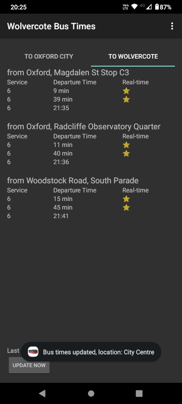

_Wolvercote Bus Times_ Android App
==================================


A simple Android app, written as a useful tool for [Wolvercote](https://en.wikipedia.org/wiki/Wolvercote)
residents, providing a single-page instant UI for departures of the local bus service to/from the 
centre of Oxford.



Toolchain, APIs etc
-------------------

The app was originally written using the Eclipse Android Development tools,
and has been migrated to Android Studio.
It was also originally written against Android SDK version 19 (min 9), and
has been updated to Android SDK version 31 (min 23).
As a result it contains some anachronisms, so it isn't an example
of current Android best practice.

Since it was originally developed, the API used to retrieve bus times has completely changed
so some of the data handling isn't as nicely structured as it could be.


Data feed
---------

Live data is retrieved from the [Oxontime](https://www.oxontime.com) website,
which is a partnership between Oxfordshire County Council and the bus operators.

Note: the app complies with the [terms of use](https://www.oxontime.com/about#terms/)
of the data feed, which give permission for personal, non-commercial use.

The Oxontime website supplies a feed for the upcoming 
departures for each stop, at 
```
https://www.oxontime.com/pwi/departureBoard/<ATCO code>
```
where `<ATCO code>` is the [ATCO code](https://www.gov.uk/government/publications/national-public-transport-access-node-schema/naptan-guide-for-data-managers)
for each stop.

The data is returned in JSON, with top-level information about the stop itself,
and an array of "calls", for each bus that is due to call at the stop.